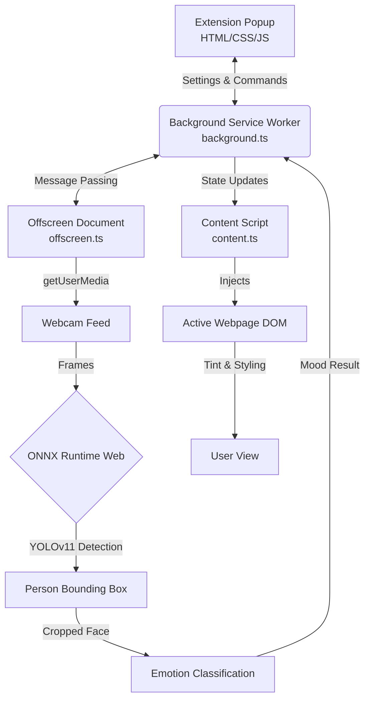

# EmoUI 🌟

EmoUI is a modern Chrome extension that uses artificial intelligence to detect your mood via your webcam and dynamically adapt your browsing experience. It helps you stay mindful of your emotional state and provides soothing support when you're feeling down.

## 🏗️ System Architecture

The project is built using a modern Chrome Extension MV3 architecture with AI processed entirely on-device for privacy.



## 🗺️ Technology Map

Here is a breakdown of the core technologies powering EmoUI:

| Domain          | Technology         | Purpose                                                                        |
| :-------------- | :----------------- | :----------------------------------------------------------------------------- |
| **Frontend**    | HTML5, Vanilla CSS | UI layout, modern glassmorphism styling                                        |
| **Logic**       | TypeScript         | Type-safe state management, Chrome API interactions                            |
| **Build Tool**  | Vite               | Fast bundling and extension asset compilation                                  |
| **AI Engine**   | ONNX Runtime Web   | Running machine learning models efficiently in the browser via WebAssembly     |
| **ML Models**   | YOLOv11 (.onnx)    | Two-stage pipeline: Person Detection -> Emotion Classification                 |
| **Chrome APIs** | Manifest V3        | Service Workers, Offscreen API (for camera), Notifications, Storage, activeTab |

## ✨ Key Features

- **Real-time Mood Detection**: Uses a YOLOv11-based ONNX model running directly in your browser.
- **Dynamic UI**: The extension popup's interface colors and icons change instantly to reflect your mood.
- **Chrome Tinting**: Your active browser tab is subtly tinted with a color that matches your mood.
- **Soothing Support**: When the AI detects an emotional dip (sadness, anger, fear), it provides gentle notifications and optional soothing music.
- **Privacy First**: Zero data collection. Processed entirely on-device and never sent to a server.

## 🚀 Installation for Development

1. **Clone the project** or download the source code.
2. **Install dependencies**:
   ```bash
   npm install
   ```
3. **Build the extension**:
   ```bash
   npm run build
   ```
4. **Load into Chrome**:
   - Open Chrome and go to `chrome://extensions/`.
   - Enable **Developer mode** (top right).
   - Click **Load unpacked** and select the `dist` folder generated after the build.

## 📤 Publishing to Chrome Web Store

To upload EmoUI to the public Chrome Web Store, follow these steps:

1. **Prepare the Release Build**:
   - Run `npm run build` to ensure the `dist/` folder contains your production-ready code.
   - Zip the contents of the `dist/` folder (do _not_ zip the root project folder, only the files _inside_ `dist`). Let's call it `emoui.zip`.
2. **Access the Developer Dashboard**:
   - Go to the [Chrome Web Store Developer Dashboard](https://chrome.google.com/webstore/devconsole/).
   - You must pay a one-time $5 registration fee if this is your first time publishing.
3. **Create a New Item**:
   - Click **Add new item** in the dashboard.
   - Upload the `emoui.zip` file you created in step 1.
4. **Fill out Store Details**:
   - **Description**: Provide a detailed description explaining what EmoUI does and highlighting the privacy aspect (no data leaves the computer).
   - **Icons & Screenshots**: Upload high-quality screenshots, your `icon128.png`, and promotional banners. (You can use the resources from the `Promotional_Website`).
   - **Privacy Justification**: Since you request permissions like `offscreen` and `notifications`, you must explicitly justify _why_ you need them. State clearly that the camera is used strictly for local mood inference and data is discarded immediately.
5. **Submit for Review**:
   - Save your draft and click **Submit for Review**. It typically takes 1-3 days for Google to review and approve the extension.

---

_Created with ❤️ for a more mindful web._
