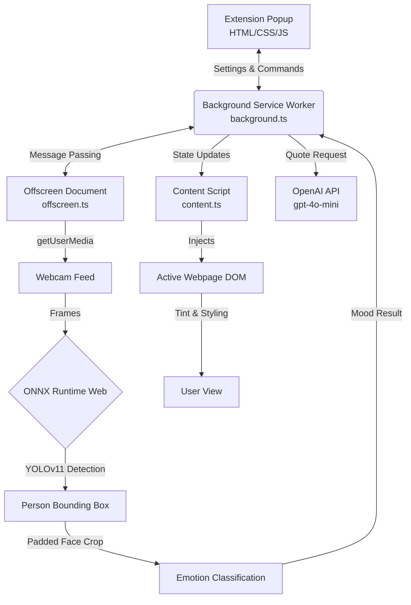

# EmoUI 🌟

EmoUI is a modern Chrome extension that uses artificial intelligence to detect your mood via your webcam and dynamically adapt your browsing experience. It helps you stay mindful of your emotional state and provides soothing support when you're feeling down — powered by on-device AI and optional OpenAI-generated quotes in English or Sinhala.

## 🏗️ System Architecture

The project is built using a modern Chrome Extension MV3 architecture with AI processed entirely on-device for privacy.



## 🗺️ Technology Map

Here is a breakdown of the core technologies powering EmoUI:

| Domain          | Technology              | Purpose                                                                        |
| :-------------- | :---------------------- | :----------------------------------------------------------------------------- |
| **Frontend**    | HTML5, Vanilla CSS      | UI layout, modern glassmorphism styling                                        |
| **Logic**       | TypeScript              | Type-safe state management, Chrome API interactions                            |
| **Build Tool**  | Vite                    | Fast bundling and extension asset compilation                                  |
| **AI Engine**   | ONNX Runtime Web        | Running ML models efficiently in the browser via WebAssembly                   |
| **ML Models**   | YOLOv11 (.onnx)         | Two-stage pipeline: Person Detection → Emotion Classification                  |
| **AI Quotes**   | OpenAI (gpt-4o-mini)    | Dynamic, context-aware motivational quote generation                           |
| **Chrome APIs** | Manifest V3             | Service Workers, Offscreen API (camera), Notifications, Storage                |

## ✨ Key Features

- **Real-time Mood Detection**: Uses a YOLOv11-based ONNX model running directly in your browser with optimized face cropping (20% contextual padding).
- **AI-Powered Quotes**: Optionally integrates with OpenAI's `gpt-4o-mini` to generate personalized, contextual quotes based on your detected mood.
- **Multilingual Support**: Quotes and fallback messages are available in both **English** and **Sinhala** (සිංහල).
- **Dynamic UI**: The extension popup's interface colors and icons change instantly to reflect your mood.
- **Chrome Tinting**: All open browser tabs are subtly tinted with a color that matches your mood in real-time.
- **Soothing Music**: When the AI detects an emotional dip (sadness, anger, fear), it provides gentle notifications with optional soothing music (Rain & Piano, Deep Meditation).
- **Smart Pausing**: Detection intelligently pauses only when needed (e.g., while you choose music) and auto-resumes for positive moods.
- **Privacy First**: Zero data collection. Camera feed is processed entirely on-device and never sent to any server. Your OpenAI API key is stored locally in your browser only.

## 🔧 How to Use

1. **Install the Extension**: Load the extension from the Chrome Web Store or install it locally for development.
2. **Click the Extension Icon**: Open the EmoUI popup from your Chrome toolbar.
3. **Press "Let's Begin"**: Grant camera access when prompted. The AI models will load and detection will start automatically.
4. **Configure Settings** (optional):
   - **Detection Interval**: How often the extension evaluates your mood (10s to 30 min).
   - **Music Prompt**: Enable or disable soothing music suggestions when sad.
   - **Quote Language**: Choose between English or Sinhala.
   - **OpenAI API Key**: Paste your `sk-...` key for AI-generated quotes (optional — native fallback quotes are always available).
5. **Browse Normally**: The extension works in the background. Your tabs will be subtly tinted and you'll receive notifications when your mood is detected.
6. **Press "Stop"**: Click Stop to halt detection and remove all tab overlays.

## 🚀 Installation for Development

1. **Clone the project** or download the source code.
2. **Install dependencies**:
   ```bash
   npm install
   ```
3. **Build the extension**:
   ```bash
   npm run build
   ```
4. **Load into Chrome**:
   - Open Chrome and go to `chrome://extensions/`.
   - Enable **Developer mode** (top right).
   - Click **Load unpacked** and select the `dist` folder generated after the build.

## 📤 Publishing to Chrome Web Store

To upload EmoUI to the public Chrome Web Store, follow these steps:

1. **Prepare the Release Build**:
   - Run `npm run build` to ensure the `dist/` folder contains your production-ready code.
   - Zip the contents of the `dist/` folder (do _not_ zip the root project folder, only the files _inside_ `dist`). Let's call it `emoui.zip`.
2. **Access the Developer Dashboard**:
   - Go to the [Chrome Web Store Developer Dashboard](https://chrome.google.com/webstore/devconsole/).
   - You must pay a one-time $5 registration fee if this is your first time publishing.
3. **Create a New Item**:
   - Click **Add new item** in the dashboard.
   - Upload the `emoui.zip` file you created in step 1.
4. **Fill out Store Details**:
   - **Description**: Provide a detailed description explaining what EmoUI does and highlighting the privacy aspect (no data leaves the computer).
   - **Icons & Screenshots**: Upload high-quality screenshots, your `icon128.png`, and promotional banners. (You can use the resources from the `Promotional_Website`).
   - **Privacy Policy URL**: Link to your hosted privacy policy page (included in `Promotional_Website/privacy.html`).
   - **Privacy Justification**: Since you request permissions like `offscreen` and `notifications`, you must explicitly justify _why_ you need them. State clearly that the camera is used strictly for local mood inference and data is discarded immediately.
5. **Submit for Review**:
   - Save your draft and click **Submit for Review**. It typically takes 1-3 days for Google to review and approve the extension.

## 🔒 Privacy Policy

EmoUI is committed to your privacy. See the full [Privacy Policy](Promotional_Website/privacy.html) for details.

**Summary:**
- Camera data is processed **entirely on-device** using ONNX Runtime Web. No images or video frames are ever transmitted or stored.
- Your OpenAI API key is stored **only in your browser's local storage** and is sent exclusively to OpenAI's servers for quote generation.
- EmoUI collects **zero personal data, analytics, or telemetry**.

---

_Created with ❤️ for a more mindful web._

